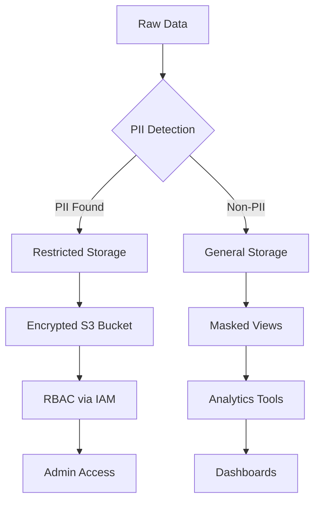

# Comprehensive Architecture for Securing PII in E-Commerce Data Pipelines

---

## 1. **PII Identification and Classification**

### a. **Automated PII Detection**

- **Data Profiling**: Use tools like AWS Macie, Azure Purview, or ML-based solutions (e.g., Confluent’s NLP models[^16]) to scan datasets for patterns matching PII (e.g., emails, credit card numbers).
- **Schema Tagging**: Leverage metadata to tag PII columns (e.g., `customer_email`, `phone_number`) in data catalogs like AWS Glue or Alation.

**Example**:

```sql  
-- Identify PII columns via metadata  
SELECT column_name, data_type, is_pii  
FROM information_schema.columns  
WHERE table_name = 'customer_data';  
```

*Result*:


| Column Name | Data Type | Is_PII |
| :-- | :-- | :-- |
| customer_id | INT | No |
| customer_email | VARCHAR | Yes |
| phone_number | VARCHAR | Yes |

---

## 2. **Schema Design for PII Segregation**

### a. **Dual-Schema Architecture**

- **Restricted Schema**: Contains raw PII (e.g., `customer_pii` table), accessible only to authorized roles.
- **General Schema**: Contains anonymized data (e.g., `customer_analytics` view), accessible to analysts.

**Implementation**:

1. **Structured Storage**:
    - Store raw PII in encrypted S3 paths (e.g., `s3://pii-bucket/restricted/customer_pii/`).
    - Store masked data in `s3://pii-bucket/general/customer_analytics/`.
2. **Column-Level Separation**:
    - Use AWS Glue or PySpark to split PII/non-PII columns into separate Parquet files.

**Example PySpark Script**:

```python  
from pyspark.sql import functions as F  

df = spark.read.parquet("s3://raw-data/customers")  
pii_columns = ["email", "phone_number"]  

# Write PII data to restricted path  
df.select(pii_columns).write.parquet("s3://pii-bucket/restricted/pii")  

# Write non-PII data to general path  
df.drop(*pii_columns).write.parquet("s3://pii-bucket/general/non_pii")  
```

---

## 3. **Data Masking and Anonymization**

### a. **Dynamic Masking in Views**

- **CASE Statements**: Mask PII in SQL views for non-privileged users.

```sql  
CREATE VIEW customer_analytics AS  
SELECT  
  customer_id,  
  CASE WHEN CURRENT_USER() IN ('admin') THEN email  
       ELSE '*****@masked.com' END AS email,  
  REGEXP_REPLACE(phone_number, '\\d', '*') AS phone_number  
FROM customer_pii;  
```


### b. **Tokenization and Hashing**

- **Azure Key Vault/S3 KMS**: Encrypt PII using AES-256 or SHA-256 hashing[^5][^11].

```python  
import hashlib  
hashed_email = hashlib.sha256(email.encode()).hexdigest()  
```


---

## 4. **Access Control and Auditing**

### a. **S3 Security Measures**

1. **Bucket Policies**: Block public access and restrict by IP/VPC.
2. **IAM Roles**: Use conditions to limit access to `restricted/` paths.

```json  
{  
  "Effect": "Deny",  
  "Principal": "*",  
  "Action": "s3:GetObject",  
  "Resource": "arn:aws:s3:::pii-bucket/restricted/*",  
  "Condition": {  
    "StringNotEquals": {"aws:PrincipalArn": "arn:aws:iam::123456789012:role/DataEngineer"}  
  }  
}  
```


### b. **Database-Level Controls**

- **Redshift/PostgreSQL RLS**: Restrict rows based on user roles.

```sql  
CREATE POLICY pii_access_policy  
ON customer_pii  
FOR SELECT  
USING (current_user = 'admin');  
```


---

## 5. **Pipeline Automation and Monitoring**

### a. **Automated PII Separation**

- **AWS Glue Workflow**:

1. **Crawlers**: Detect new data in `s3://raw-data/`.
2. **ETL Jobs**: Split PII/non-PII columns using PySpark.
3. **Triggers**: Notify via SNS if PII is detected in general paths[^14].


### b. **Real-Time Monitoring**

- **CloudWatch Alarms**: Track unauthorized access attempts to restricted paths.
- **AWS CloudTrail**: Log all S3 API calls for audit compliance[^8].

---

## 6. **Compliance and Incident Response**

### a. **Data Minimization**

- Collect only essential PII (e.g., exclude SSN unless mandatory)[^8].
- **GDPR/CCPA Compliance**: Automate right-to-erasure requests using AWS Lambda:

```python  
def delete_pii(customer_id):  
    delete_from_restricted_bucket(customer_id)  
    delete_from_database(customer_id)  
```


### b. **Incident Management**

- **JIRA Integration**: Auto-create tickets for PII breaches using AWS EventBridge[^7].
- **Forensic Backups**: Retain encrypted PII backups for 30 days in S3 Glacier[^11].

---

## Architectural Diagram



---

## Challenges \& Solutions

| **Challenge** | **Solution** |
| :-- | :-- |
| **False Positives in PII Detection** | Use ML models with custom regex rules[^16]. |
| **Key Management** | Rotate keys quarterly using AWS KMS[^11]. |
| **Cross-Account Access** | Use S3 Access Points + IAM roles[^14]. |

---

## Conclusion

By integrating dual schemas, dynamic masking, and automated access controls, e-commerce companies can secure PII while enabling analytics. The pipeline ensures compliance with GDPR/CCPA via encryption, auditing, and least-privilege access. For the described use case, extending this architecture with real-time PII detection (e.g., Confluent’s NLP[^16]) and data lineage tools (e.g., OpenLineage) would further enhance traceability and breach response times.

<div style="text-align: center">⁂</div>

[^1]: https://github.com/RiadBensalem/E-commerce-Sales-Analysis-Pipeline

[^2]: https://www.greathorn.com/blog/best-practices-for-securing-pii-in-ecommerce-and-delivery-services/

[^3]: https://www.sigmoid.com/blogs/data-pipeline-architecture-for-cpg/

[^4]: https://www.ge.com/news/press-releases/pii-pipeline-solutions-introduces-pvi-lite-newest-member-pipeview™-integrity

[^5]: https://www.sigmoid.com/blogs/implementation-of-a-privacy-first-pii-framework-on-azure/

[^6]: https://rivery.io/data-learning-center/data-pipeline-architecture/

[^7]: https://www.youtube.com/watch?v=PMYxeWeNoX8

[^8]: https://www.stxnext.com/blog/safeguarding-personal-data

[^9]: https://www.bakerhughes.com/sites/bakerhughes/files/2021-12/160122 PII Pipeline Solutionsv2 (1).docx_0.pdf

[^10]: https://www.simform.com/blog/best-practices-to-build-data-pipelines/

[^11]: https://www.piiano.com/blog/pii-security-best-practices

[^12]: https://fabric.inc/blog/developer/data-orchestration-ecommerce

[^13]: https://shopify.engineering/managing-pii-shopify-scale

[^14]: https://www.wissen.com/blog/data-security-and-privacy-challenges-in-modern-data-pipelines

[^15]: https://newrelic.com/pt/blog/how-to-relic/4-ways-manage-pii-in-log-pipeline

[^16]: https://www.confluent.io/blog/real-time-pii-detection-via-ml/

[^17]: https://www.piiano.com/blog/choosing-pii-protection-solution

[^18]: https://www.pipeline-conference.com/companies/pii-pipeline-solutions

[^19]: https://ppsa-online.com/papers/12-Aberdeen/2012-02-PII-slides.pdf

[^20]: https://cloud.google.com/architecture/de-identification-re-identification-pii-using-cloud-dlp

[^21]: https://www.montecarlodata.com/blog-data-pipeline-architecture-explained/

[^22]: https://www.ge.com/news/press-releases/pii-pipeline-solutions-introduces-new-cfas-service-help-operators-enhance-pipeline

[^23]: https://www.bakerhughes.com/sites/bakerhughes/files/2021-12/141119 Mapping \& Strain capabilities.pdf

[^24]: https://www.worldpipelines.com/business-news/23102013/PII_Pipeline_Solutions_promotes_pipeline_safety/

[^25]: https://cloud.google.com/architecture/design-secure-deployment-pipelines-bp

[^26]: https://mattermost.com/blog/ci-cd-pipeline-security/

[^27]: https://crm-masters.com/8-ways-to-improve-your-e-commerce-stores-security/

[^28]: https://airbyte.com/tutorials/building-an-e-commerce-data-pipeline-a-hands-on-guide-to-using-airbyte-dbt-dagster-and-bigquery

[^29]: https://blog.gitguardian.com/secure-by-design-software-in-devsecops/

[^30]: https://www.linkedin.com/pulse/importance-security-design-cicd-product-development-thomas-simmons-exive

[^31]: https://github.com/behnamyazdan/ecommerce_realtime_data_pipeline

[^32]: https://docs.cdpi.dev/the-dpi-wiki/dpi-tech-architecture-principles/security-and-privacy-by-design

[^33]: https://www.skyflow.com/post/maximize-privacy-preserve-data-analytics-utility

[^34]: https://www.wiz.io/academy/security-by-design

[^35]: https://www.rudderstack.com/learn/data-security/what-is-pii-masking/

[^36]: https://docs.databricks.com/en/security/privacy/gdpr-delta-get-started.html

[^37]: https://dzone.com/refcardz/e-commerce-development-essentials

[^38]: https://www.upsolver.com/blog/protecting-sensitive-data-s3-tokenization

[^39]: https://codilime.com/blog/data-pipeline-architecture-explained/

